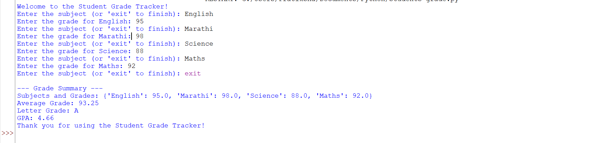

#### NAME:- Prachi Padmakar Gaikwad
#### Company:- CODETECH IT SOLUTION
#### ID:- CT08DS8536
#### Domain:- Python
#### Duration:- 25 Sept to 25 Oct 2024

# Overview of the Project

#### Project: Student Grade Tracker

## Objective

* Data Collection: Develop a system to collect and store student grades, in a structured format.User Interface: Create an intuitive user interface that allows students and 
  teachers to easily input and view grades and feedback.

* User Interface: Create an intuitive user interface that allows students and teachers to easily input and view grades and feedback.

* Grade Calculation: Implement algorithms to calculate overall grades, GPAs, and class averages based on various weightings (assignments, exams, projects).

* Data Security: Implement security measures to protect sensitive student data, ensuring compliance with relevant data protection regulations.

* These objectives will guide the development process and ensure that the grade tracker meets the needs of its users effectively.

## Key Activities

* Grade Input: Entering grades for various assessments, such as assignments, quizzes, and exams.
* Grade Organization: Categorizing and organizing grades by subject or type to facilitate easy tracking.
* Average Calculation: Computing the average grade across subjects or assignments to assess overall performance.
* Letter Grade Assignment: Determining letter grades based on average scores using a predefined grading scale.
* GPA Calculation: Calculating the Grade Point Average (GPA) based on the average score or specific grading criteria.

## Technology Used

programming language (eg. Javascript, Python), development tools (IDE, libraries).
